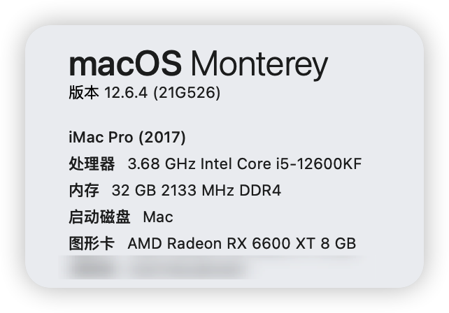

黑苹果 EFI
- 主板: 技嘉 B660I AORUS PRO DDR4
- CPU: i5-12600KF
- 显卡: Radeon RX 6600 Challenger ITX 8GB
- 内存: Corsair DDR4 16GB x 2 (3000MHz)
- 声卡、蓝牙、WIFI都是板载
- 系统版本: Monterey 12.6.4
- OC 引导版本: 0.9.1
- 配套系统镜像下载地址：https://pan.baidu.com/s/1sKHJZcZ0Lq2KhJpvlMOmOw?pwd=y48d
- 安装工具包下载：https://pan.baidu.com/s/1cUjbo11-ciPpvOT_-NZVPw?pwd=y48d
----

已知问题：
   1. 无法使用隔空投送

# B660I-12600KF-EFI
